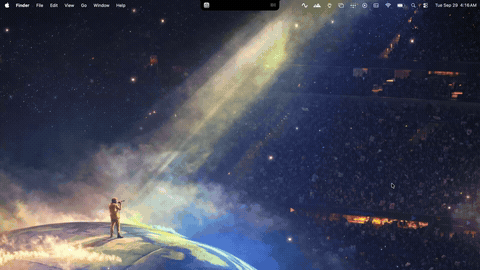

# my-notch

**A browser that lives in your MacBook notch.**

A personal fork of [Atoll](https://github.com/Ebullioscopic/Atoll) (the
boring.notch family) that adds a real WebKit browser tab inside the notch. Click
the notch, land on YouTube or anywhere else, tuck the notch away — and the page
keeps playing, because nothing is ever torn down.



[](LICENSE)


**Landing page:** https://gokulsvision.github.io/my-notch/

---

## Why this fork exists

Atoll turns the notch into a live surface — media controls, calendar, shelf,
terminal, stats. This fork adds one more tab: a real WebKit browser. The whole
point is a single use case done properly: **watch videos and read timelines in
a panel that drops out of the notch, then disappears when you are done** —
without switching windows, without losing your place.

## What's different from upstream Atoll

Everything upstream works unchanged. This fork is strictly additive.

| Area | Addition |
|---|---|
| **Browser tab** | A new "Browser" tab (globe icon) in the notch tab strip |
| **Panel sizing** | S/M/L/XL presets plus a drag handlebar for any height in between |
| **Pin & auto-close** | Pin keeps the panel open; unpinning re-arms a configurable auto-close timer |
| **Session** | Tabs and logins persist across app restarts |
| **Settings** | A dedicated "Browser" section: enable, search engine, size, auto-close, force dark mode |

Zero visual or behavioral changes to any existing Atoll feature.

---

## Engineering highlights

The interesting work is all in making a browser behave correctly inside a notch
panel that can be closed, resized, and torn down at any moment. These are the
problems that took real time.

**One persistent `WKWebView` per tab.** SwiftUI recreates views aggressively,
and recreating a `WKWebView` reloads the page and drops session state. So each
tab owns exactly one webview for its entire lifetime; the SwiftUI wrapper just
re-binds the existing instance into the view tree (`makeNSView` returns it,
`updateNSView` does nothing). Hidden tabs stay alive off-screen, so switching
tabs never reloads. Tabs are capped at 4, recycling the oldest inactive tab to
keep memory bounded without throwing away what you are watching.

**Keep-alive across the notch lifecycle.** The tab list and its webviews live on
a shared singleton that outlives individual SwiftUI view lifecycles. Closing the
notch, auto-closing it, or restarting the app never destroys a page. This is the
single most important property for the primary use case: leave a video playing,
tuck the notch away, come back to it exactly where it was.

**Gesture interception via local `NSEvent` monitors.** The drag handlebar is a
transparent `NSView` that consumes mouse events with local `NSEvent` monitors.
Two things forced this. First, Atoll installs a notch-level
`DragGesture(minimumDistance: 0)` that swallows every mouse-down before a plain
`NSView.mouseDown` or SwiftUI gesture would fire — local monitors run earlier and
can veto events. Second, a SwiftUI `DragGesture` dies mid-drag, because resizing
the window underneath it re-lays-out its coordinate space and cancels the
gesture. AppKit event streams are immune to both.

**Absolute drag math, so resizing cannot drift.** The panel's bottom edge is
simply the cursor's distance from the top of the screen — the window is pinned to
the screen top, so there are no anchors and no accumulated deltas. The window
moving under the cursor cannot cause drift.

**One source of truth for size, across three call sites.** The notch height comes
from a single value, read consistently by the SwiftUI layout, the view model, and
the app delegate's window sizing. Two hard-won details: the hosting view needs
`autoresizingMask = [.width, .height]` or the window grows while the content keeps
the old size (black dead space, a stranded bezel); and the browser pins itself to
one explicit height rather than filling with `maxHeight: .infinity`, which
produced ambiguous layout inside the notch's `VStack`.

**Freezing generic resize publishers.** While the browser tab is open, the usual
notch-resize signals (network HUD, timer, reminders, music state) are frozen.
Live web content perturbs SwiftUI intrinsic sizes, which caused constant window
jitter. Only tab switches, size presets, and handlebar drags may move the window.

**Session persistence on WebKit's own store.** The tab list and active selection
are saved on every navigation and tab mutation, and restored on launch —
background tabs lazily, loading only when selected. Logins persist because
webviews use WebKit's default disk-backed cookie store, so a single YouTube login
survives both notch cycles and app restarts.

**Dark mode that actually matches.** Each webview's `NSAppearance` is pinned to
`darkAqua`, so `prefers-color-scheme: dark` matches on every site regardless of
the system appearance — the same mechanism Safari's automatic darkening uses. The
chrome itself is hard-black, matching the notch.

**Three-step omnibox resolution.** Input resolves as: a full URL with a scheme and
host navigates directly; a bare dotted domain gets `https://` prepended; anything
else goes to the configured search engine (DuckDuckGo by default, Google
optional).

---

## Panel sizing

The notch height while the Browser tab is active comes from one value: an exact
custom height from a drag, or a preset — S 260 / M 360 / L 460 / XL 580. XL is
the default.

- **Presets** — tap S/M/L/XL in the toolbar. Picking one clears any custom height.
- **Handlebar** — the capsule at the panel's bottom edge. Drag it and the bottom
  edge follows the cursor 1:1 (down means taller).

## Pin & auto-close

- **Unpinned** — when the cursor leaves the notch, the panel closes after the
  configured delay (default 5s; options: immediate / 5 / 15 / 30 / never).
- **Pinned** — never auto-closes, and survives outside clicks and the toggle
  shortcut. Unpinning with the cursor away re-arms the timer.
- The browser is exempt from Atoll's scroll-to-close gesture, so scrolling a page
  never reads as a close swipe. Auto-close only fires when the cursor is genuinely
  off the notch, so a video is never interrupted.

---

## Building

Requirements: **Xcode 16+** (built with Xcode 26.6 on macOS 26), plus the Metal
toolchain (`xcodebuild -downloadComponent MetalToolchain`).

```bash
xcodebuild -project DynamicIsland.xcodeproj -scheme DynamicIsland \
  -configuration Debug build \
  CODE_SIGN_IDENTITY="Developer ID Application" \
  DEVELOPMENT_TEAM=<your-team-id> \
  CODE_SIGN_STYLE=Manual
```

The app bundle lands in
`~/Library/Developer/Xcode/DerivedData/DynamicIsland-*/Build/Products/Debug/Atoll.app`
(the binary keeps the upstream `Atoll` name).

## Settings keys

| Key | Default | Purpose |
|---|---|---|
| `enableBrowserFeature` | `false` | Adds the Browser tab |
| `browserSearchEngine` | `.duckDuckGo` | Omnibox fallback search |
| `browserPanelSize` | `.extraLarge` | Preset notch height |
| `browserAutoCloseDelay` | `5` | Seconds before auto-close (0 = immediate, −1 = never) |
| `browserForceDarkMode` | `true` | Pin webviews to dark appearance |

---

## Docs

- [`BROWSER.md`](BROWSER.md) — the mini-browser in depth: architecture, the
  resize system, session persistence, and the gesture-interception story.
- [Landing page](https://gokulsvision.github.io/my-notch/) — the video demo and
  feature overview.

## Git layout

- `upstream` → Ebullioscopic/Atoll (pull future updates from here)
- `origin` → this repo
- `dev` → the active branch; the mini-browser work has landed here
- `feature/browser` → where the mini-browser feature was developed
- `sync/upstream-*` → snapshots pulled from upstream

## Known limitations

- **Passkeys/WebAuthn fail** inside the notch panel (`ASAuthorizationController`
  error 1004) — the system credential sheet will not present from a borderless
  non-activating window. Use a password or the cross-device QR flow; the session
  then persists normally.
- Page zoom is a plain `WKWebView.magnification` scale; fit-page is a fixed 0.45×
  rather than computed per page.
- Fullscreen and DRM video follow WebKit's normal rules; the panel does not bypass
  DRM.
- Debug `#if DEBUG` prints (`[Bezel]`, `[BrowserSize]`) remain from the build-out
  and compile out of release builds.

## License & provenance

Atoll is GPL-3.0 (see upstream); this fork inherits that license. Atoll and
DynamicIsland are trademarks of their respective owners, and this project is not
associated with, endorsed by, or affiliated with Apple or Apple's "Dynamic
Island" product — see [`TRADEMARKS`](TRADEMARKS) and [`NOTICE`](NOTICE). The
browser tab's search-engine dispatch and keep-tab-alive pattern reference
[Search](https://github.com/…/Search) (MIT), kept as inspiration only.
